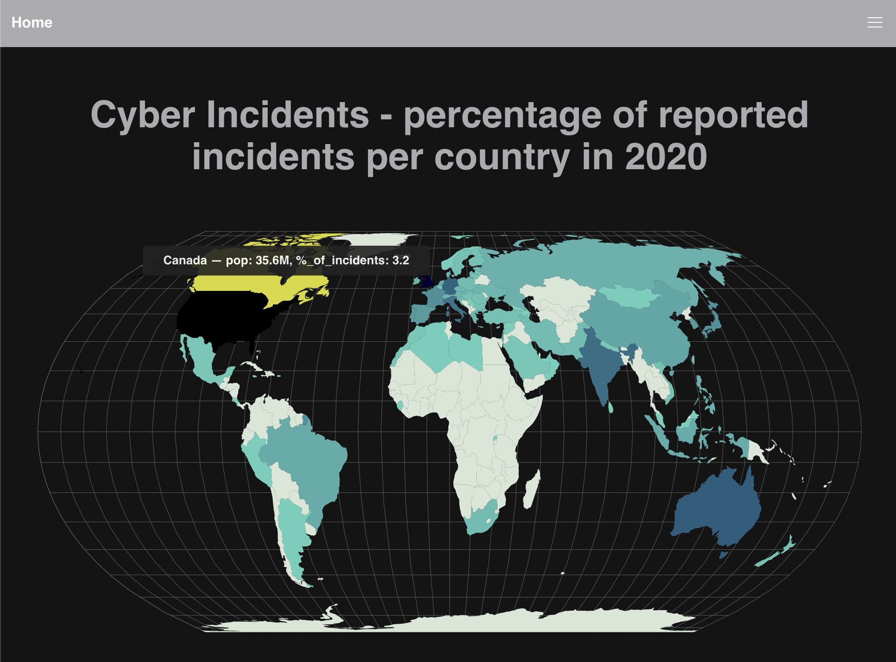
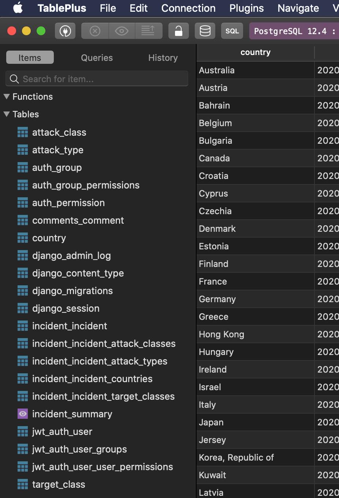
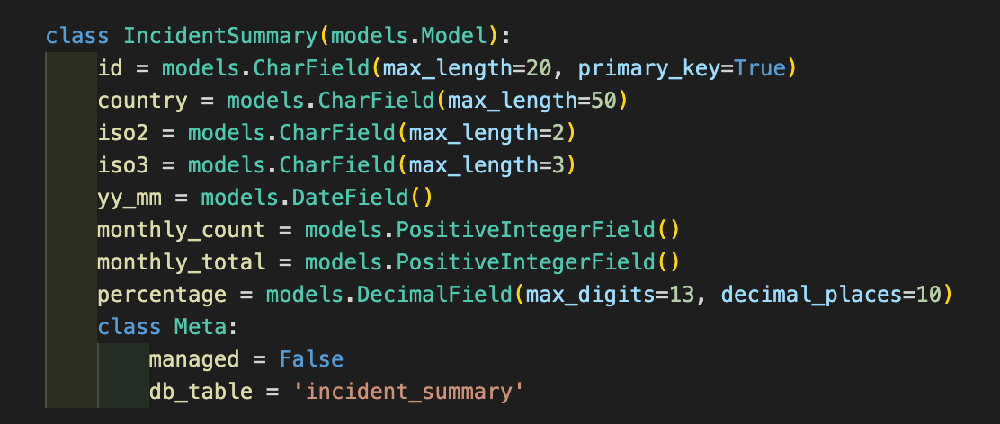
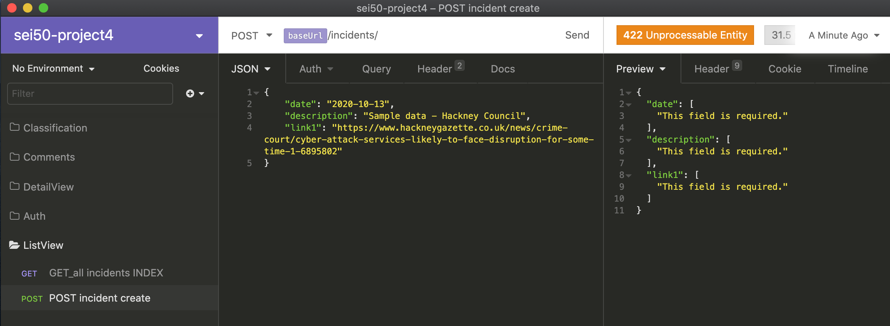
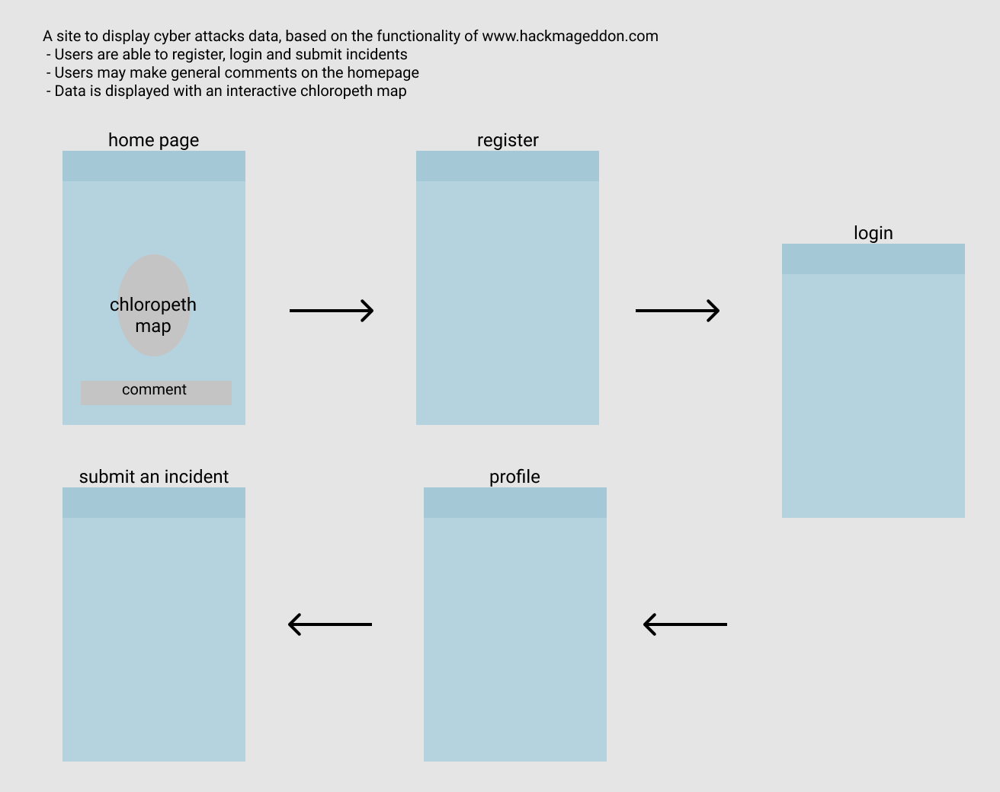

# React & Django | sei50-project IV
A CRUD App, the backend server utilises Django with Rest Framework for REST APIs and interacts with a PostgreSQL database.   While the frontend side is made with React and Axios.

An individual project over approx one week.

## Table of contents
* [General info](#general-info)
* [Screenshots](#screenshots)
* [Pre-Work](#pre-work)
* [Technologies](#technologies)
* [Setup](#setup)
* [Features](#features)
* [Status](#status)

## General info
For the topic I chose to imitate the functionality of the site www.hackmageddon.com which is used to collate information on CYBER ATTACKS.

## Screenshots

The image displayed is of a chloropeth map on the landing page.  Cyber incidents are submitted, collated and the percentage calculated via postgreSQL.  A tooltip displays the percentage of the cyber attacks, per country in 2020.  

Why is the country population data displayed also?  I just like statistics!



TablePlus was used for relational database management.  A SQL view was created in postgreSQL to calculate the cyber attack percentages and in Django a corresponding unmanaged model to interact with the view.  The incident_summary table is highlighted in purple.




Insomnia was invaluable for testing the API requests.



## Pre-Work

Figma and Quick Database Diagrams (QuickDBD) were used during the design phase of the sei-project  (software engineering immersive).   In figma I created a wireframe of the application with the main content and functionality for the minimum viable product (MVP).  

The entity relationship diagram (erd) was used to plan database layout and to decipher the table relationships.  This was with the software QuickDBD.




## Technologies

Front End:
- React
- JavaScript
- Axios
- SCSS
- Bulma, @fortawesome/fontawesome-free
- D3 fetch, d3 scale
- React router dom
- React notify toast
- React select
- React simple maps
- React tooltip

Dev Tools:
- Heroku
- Git 
- Github
- VSCode
- Insomnia
- Eslint
- Google Chrome dev tools
- TablePlus
- Figma
- Quick Database Diagrams (QuickDBD

Back End:
- Django
- Python
- Psycopg2 Binary
- Djangorestframework
- Pyjwt


## Setup
Deployed with Heroku the React API webapp is hosted here:

*** Arriving shortly ***

Use the following commands to run the development server:

- `python manage.py runserver` backend 
- `npm start` frontend side

Deployment via Heroku involves many steps, in a short summary:
- Update the gitignore file  and run `npm run build` to prepare the frontend side for a build
- run `pipenv install python-dotenv` and `pipenv install dj-database-url` plus additional steps to prepare the backend

## Code Examples

The SQL view query used to create the incident_summary SQL view:
```SQL
WITH number_of_monthly_incidents AS (
         SELECT date_trunc('month'::text, a.date::timestamp with time zone) AS yyyy_mm,
            c.name AS countries,
            count(*) AS count,
            c.iso2,
            c.iso3
           FROM incident_incident a,
            incident_incident_countries b,
            country c
          WHERE a.id = b.incident_id AND b.country_id = c.id AND NOT c.name::text = '>1'::text
          GROUP BY (date_trunc('month'::text, a.date::timestamp with time zone)), c.name, c.iso2, c.iso3
          ORDER BY (date_trunc('month'::text, a.date::timestamp with time zone))
        ), total_monthly_incidents AS (
         SELECT date_trunc('month'::text, a.date::timestamp with time zone) AS yyyy_mm,
            count(*) AS monthly_tot
           FROM incident_incident a,
            incident_incident_countries b,
            country c
          WHERE a.id = b.incident_id AND b.country_id = c.id AND NOT c.name::text = '>1'::text
          GROUP BY (date_trunc('month'::text, a.date::timestamp with time zone))
        )
 SELECT number_of_monthly_incidents.countries AS country,
    to_date(number_of_monthly_incidents.yyyy_mm::text, 'YYYY-MM-DD'::text) AS yy_mm,
    number_of_monthly_incidents.count AS monthly_count,
    total_monthly_incidents.monthly_tot AS monthly_total,
    number_of_monthly_incidents.iso2,
    number_of_monthly_incidents.iso3,
    concat_ws('_'::text, to_date(number_of_monthly_incidents.yyyy_mm::text, 'YYYY-MM-DD'::text), number_of_monthly_incidents.iso2) AS id,
    round(number_of_monthly_incidents.count::numeric / total_monthly_incidents.monthly_tot::numeric, 3) AS percentage
   FROM number_of_monthly_incidents,
    total_monthly_incidents
  WHERE number_of_monthly_incidents.yyyy_mm = total_monthly_incidents.yyyy_mm;
  ```

Django API view for the incident summary data:

```python
class IncidentSummaryView(APIView):
    def get(self, _request):
        incident_summary = IncidentSummary.objects.all()
        serialized_incident_summary = IncidentSummarySerializer(incident_summary, many=True)
        return Response(serialized_incident_summary.data, status=status.HTTP_200_OK)
```

Shown is part of the React-Select configuration for the country drop-down list.  Country data is stored in a many-to-many table and accessed via an api request.  When a user submits incident data they can use the country drop-down list

```jsx
<div className="select is-multiple">
  <label className="label">Country</label>
  <div className="control">
    <Select
      options={this.state.classification.countryIndex.map((item) => ({ 'value': item.id, 'label': item.name }))}
      isMulti
      placeholder="Select one or more"
      name="countries"
      value={countries}
      onChange={this.handleMultiSelectChangeCountries}
    />
  </div>
</div>
```

## Features
List of features & TODOs for future development
* Add a slider component to the chloropeth map, a user would be able to filter by month or year
* Users are able to register, login, submit and edit incidents.  They are also able to create and delete their comments.  The plan was to display these comments beneath the chloropeth map.
* A file upload for bulk data imports
* A menu dropdown to review incidents that have not yet been vetted for administration

## Status
Project is: _paused (phase 1 complete, GA software immersion course concluded end of Oct 2020)