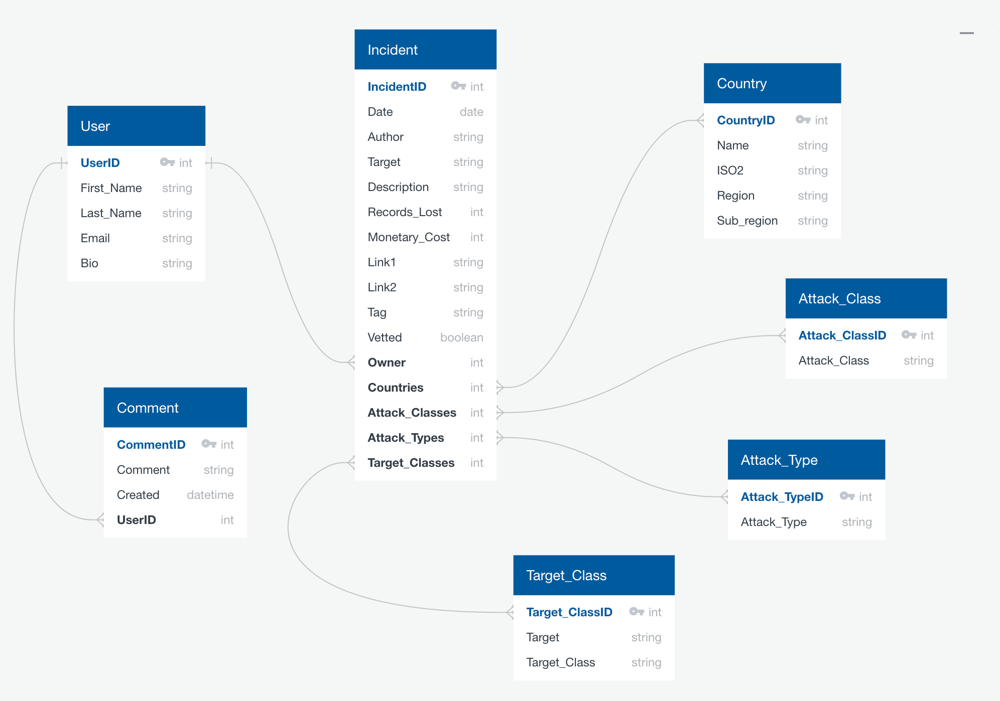

# React & Django | sei50-project IV
A CRUD application, project four is built with Django and a Rest Framework for REST APIs that interacts with a PostgreSQL database. The frontend side is built with React and Axios.

An individual project over approx one week.

## Table of contents
* [General info](#general-info)
* [Screenshots](#screenshots)
* [Pre-Work](#pre-work)
* [Technologies](#technologies)
* [Setup](#setup)
* [Code Examples](#code-examples)
* [Features](#features)
* [Challenges and Wins](#challenges-and-wins)
* [Status](#status)

## General info
For the topic I chose to imitate the functionality of the site www.hackmageddon.com which is used to collate information on CYBER ATTACKS.

## Screenshots

The image displayed is of a chloropeth map on the landing page.  Cyber incidents are submitted, collated and the percentage calculated via postgreSQL.  A tooltip displays the percentage of the cyber attacks, per country in 2020.  

Why is the country population data displayed also?  I just like statistics!


TablePlus was used for relational database management.  A SQL view was created in postgreSQL to calculate the cyber attack percentages and in Django a corresponding unmanaged model to interact with the view.  The incident_summary table is highlighted in purple.


Insomnia was invaluable for testing the API requests.


## Pre-Work

Figma and Quick Database Diagrams (QuickDBD) were used during the design phase of the sei-project  (software engineering immersive).   In figma I created a wireframe of the application with the main content and functionality for the minimum viable product (MVP).  

The entity relationship diagram (erd) was used to plan database layout and to decipher the table relationships.  This was with the software QuickDBD.




## Technologies

Front End:
- React
- JavaScript
- Axios
- SCSS
- Bulma, @fortawesome/fontawesome-free
- D3 fetch, d3 scale
- React router dom
- React notify toast
- React select
- React simple maps
- React tooltip

Dev Tools:
- Heroku
- Git 
- Github
- VSCode
- Insomnia
- Eslint
- Google Chrome dev tools
- TablePlus
- Figma
- Quick Database Diagrams (QuickDBD)

Back End:
- Django
- Python
- Psycopg2 Binary
- Djangorestframework
- Pyjwt
- PostgreSQL

## Setup
Deployed with Heroku the React API webapp is hosted here:

[GA LDN sei-project-four](https://sei50-p4.herokuapp.com/)

Use the following commands to run the development server:

- during development pipenv was used to manage dependencies on a per-project basis `pipenv shell`  
- on the backend run `python manage.py runserver` and navigate to localhost:8000

Deployment via Heroku involves many steps, in a short summary:
- update the gitignore file  and run `npm run build` to prepare the frontend side for a build
- run `pipenv install python-dotenv` and `pipenv install dj-database-url` plus additional steps such as edit `project\urls.py` and `project\settings.py`

Additional deployment steps:
- The heroku app was pushed from a branch named main (my default github branch is base) [Heroku git branch deployments](https://devcenter.heroku.com/articles/git-branches) `git push heroku main`
- Connecting to the Heroku Postgres db with the Heroku CLI, I created the incident summary view used to calculate the percentages for the chloropeth map.

  `heroku pg:psql postgresql …`  
  `create view "incident_summary" as …`

## Code Examples

The SQL view query used to create the incident_summary SQL view, percentages are stored by country and by month:
```SQL
WITH number_of_monthly_incidents AS (
         SELECT date_trunc('month'::text, a.date::timestamp with time zone) AS yyyy_mm,
            c.name AS countries,
            count(*) AS count,
            c.iso2,
            c.iso3
           FROM incident_incident a,
            incident_incident_countries b,
            country c
          WHERE a.id = b.incident_id AND b.country_id = c.id AND NOT c.name::text = '>1'::text
          GROUP BY (date_trunc('month'::text, a.date::timestamp with time zone)), c.name, c.iso2, c.iso3
          ORDER BY (date_trunc('month'::text, a.date::timestamp with time zone))
        ), total_monthly_incidents AS (
         SELECT date_trunc('month'::text, a.date::timestamp with time zone) AS yyyy_mm,
            count(*) AS monthly_tot
           FROM incident_incident a,
            incident_incident_countries b,
            country c
          WHERE a.id = b.incident_id AND b.country_id = c.id AND NOT c.name::text = '>1'::text
          GROUP BY (date_trunc('month'::text, a.date::timestamp with time zone))
        )
 SELECT number_of_monthly_incidents.countries AS country,
    to_date(number_of_monthly_incidents.yyyy_mm::text, 'YYYY-MM-DD'::text) AS yy_mm,
    number_of_monthly_incidents.count AS monthly_count,
    total_monthly_incidents.monthly_tot AS monthly_total,
    number_of_monthly_incidents.iso2,
    number_of_monthly_incidents.iso3,
    concat_ws('_'::text, to_date(number_of_monthly_incidents.yyyy_mm::text, 'YYYY-MM-DD'::text), number_of_monthly_incidents.iso2) AS id,
    round(number_of_monthly_incidents.count::numeric / total_monthly_incidents.monthly_tot::numeric, 3) AS percentage
   FROM number_of_monthly_incidents,
    total_monthly_incidents
  WHERE number_of_monthly_incidents.yyyy_mm = total_monthly_incidents.yyyy_mm;
  ```

Django API view for the incident summary data:

```python
class IncidentSummaryView(APIView):
    def get(self, _request):
        incident_summary = IncidentSummary.objects.all()
        serialized_incident_summary = IncidentSummarySerializer(incident_summary, many=True)
        return Response(serialized_incident_summary.data, status=status.HTTP_200_OK)
```

Shown is part of the React-Select configuration for the country drop-down list.  Country data is stored in a many-to-many table and accessed via an api request.  When a user submits incident data they can use the country drop-down list

```jsx
<div className="select is-multiple">
  <label className="label">Country</label>
  <div className="control">
    <Select
      options={this.state.classification.countryIndex.map((item) => ({ 'value': item.id, 'label': item.name }))}
      isMulti
      placeholder="Select one or more"
      name="countries"
      value={countries}
      onChange={this.handleMultiSelectChangeCountries}
    />
  </div>
</div>
```

Following the API get request, with incidentSummary, the MapChartDataFiltered function filters the map data by month or year determined by the constant yearMonthFilter.  As the map data is calculated in the SQL view by country and by month, the percentage by country by year is calculated in the frontend:  

```jsx
export async function MapChartDataFiltered(apiResponse){

  // yearMonthFilter ending in 00 signifies a year, '2020-00' === '2020'
  const yearMonthFilter = '2020-00'

  if (yearMonthFilter.endsWith('00')){
    const year = yearMonthFilter.substring(0,4)
    const yearData = apiResponse.filter(item => {
      return item.yy_mm.startsWith(String(year))
    })
    const yearTotal = yearData.reduce((total, current) => {
      return total + Number(current.monthly_count)
    }, 0 )
    const countryPercentage  = yearData.reduce((countries, country) => {
      countries[country.country] = {
        country: country.country,
        iso2: country.iso2,
        iso3: country.iso3,
        percentage: (country.country in countries ? Number(countries[country.country].percentage) : 0) + Number(country.monthly_count) / yearTotal 
      }
      return countries
    }, [])
    return Object.values(countryPercentage)
  } else {
    const monthData = apiResponse.filter(item => {
      return item.yy_mm.startsWith(String(yearMonthFilter))
    })
    return monthData
  } 
}
```

The topojson file was sourced from [React-Simple-Maps](https://github.com/zcreativelabs/react-simple-maps/tree/master/topojson-maps) and includes the country population estimates

```jsx
const geoUrl =
  'https://raw.githubusercontent.com/zcreativelabs/react-simple-maps/master/topojson-maps/world-110m.json'
```

## Features
List of features & TODOs for future development
* Add a slider component to the chloropeth map, a user would be able to filter by month or year
* Users are able to register, login, submit and edit incidents.  They are also able to create and delete their comments.  The plan was to display these comments beneath the chloropeth map.
* A file upload for bulk data imports
* A menu dropdown to review incidents that have not yet been vetted for administration


## Challenges and Wins
* Challenges included iterations of the SQL query and final view creation, defining the unmanaged table in Django, ensuring the view was indexed and the table had a primary key required for the API get request, incidentSummary
* Determining the yearly percentage in JavaScript, with reduce and recreating the JSON format (code snippet shown [Code Examples](#code-examples))
* React-Select configuration for the drop-down lists, for instance mapping the country data with only the fields required for the drop-table, then mapping again when the country selections are submitted.  Ensuring the object format and determining the required fields for display and incident submitting
* The chloropeth map incorporates [React-Hooks](https://reactjs.org/docs/hooks-overview.html) working with useEffect and useState was new and a challenge, it was great to see the setTooltipContent displaying


## Status
Project is: _paused (phase 1 complete, GA software immersion course concluded end of Oct 2020)